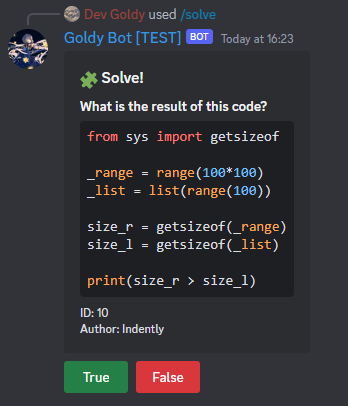
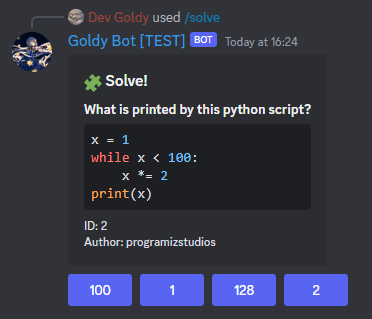

  

  # Codelma

  How well do you know Python? Challenge yourselves with Coding quizzes and solving Python code snippets.

  **True or False**          | **Multiple Choice**
  :-------------------------:|:-------------------------:
   | 

 

> *More readme coming soon...*
